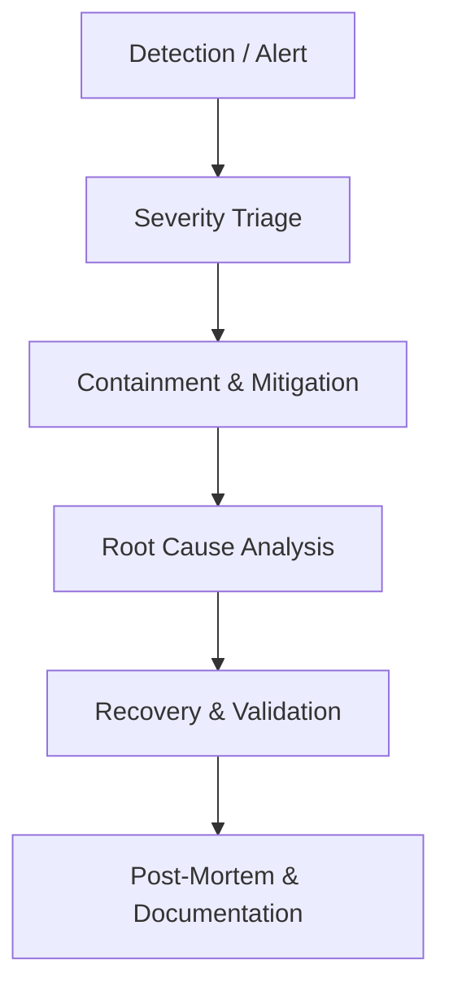

# CSP VillageMitra — Incident Response & Severity Plan

## 1. Purpose
This document defines incident classification, response protocols, escalation paths, and post-mortem procedures for operational, security, or data availability incidents impacting CSP VillageMitra.

---

## 2. Severity Classification Matrix

| Severity Level | Definition | Target Response | Target Resolution | Examples |
|---|---|---|---|---|
| **P0 (Critical Blocker)** | Total outage of citizen portal; data breach or credential leakage; unmitigated data loss. | < 15 Minutes | < 2 Hours | Supabase database paused or unreachable; RLS failure exposing private survey data; production domain offline. |
| **P1 (Major Issue)** | Critical feature failure with no workaround; citizen grievance submission down; survey data ingestion failing. | < 30 Minutes | < 6 Hours | Offline sync queue failing to drain; search RPC returning 500 errors; administrative authentication locked. |
| **P2 (Degraded Performance)** | Non-critical feature degradation with viable workaround; minor UI distortion or localization bug. | < 2 Hours | < 24 Hours | Bilingual Telugu translation missing for new announcement; slow response times on analytics charts. |
| **P3 (Minor Inquiry)** | Minor content error; styling issue; enhancement request. | < 24 Hours | Next sprint cycle | Typo in panchayat phone number; broken external link to state department. |

---

## 3. Incident Response Workflow

### Phase 1: Detection & Triage
1. Classify incident according to Severity Matrix.
2. Designate Incident Commander (Lead Developer or Project Coordinator).
3. Notify stakeholders via communication channel.

### Phase 2: Containment
- If data exposure is identified: Temporarily restrict API access via Supabase dashboard or deploy emergency maintenance page via Vercel.
- If deployment causes regressions: Execute immediate 1-click rollback in Vercel to previous deployment commit.

### Phase 3: Resolution & Validation
- Verify fix in staging environment before applying to production.
- Execute automated test suite (`npm --prefix app test`, `node --test tests/*.test.js`).
- Verify live health endpoint (`/api/health?probe=readiness`).

### Phase 4: Post-Mortem & Review
Within 48 hours of any P0 or P1 incident, publish an incident review detailing:
- Timeline of events.
- Root cause.
- Preventive actions and architecture improvements.
